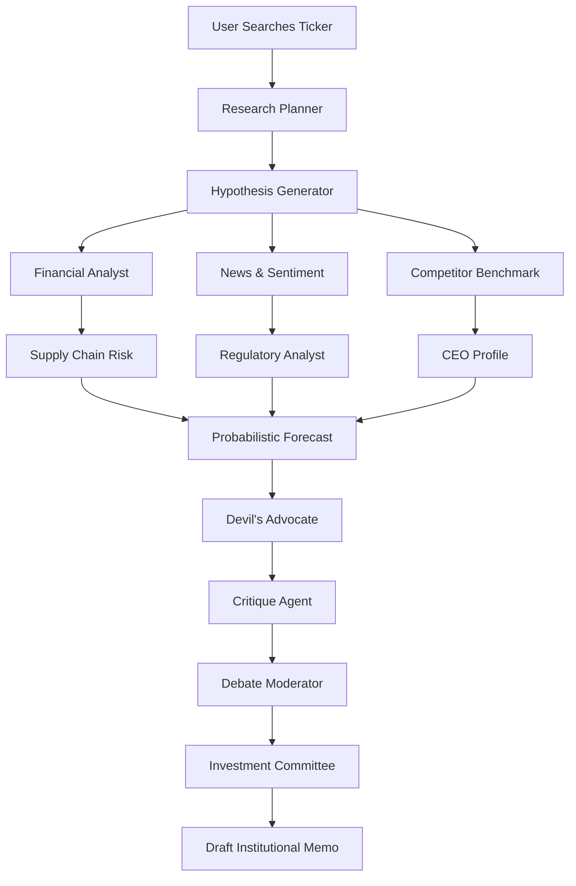

# AETHER-X & AI-IROS: THE COMPLETE SYSTEM MANUAL
### Enterprise Consciousness Operating System & Autonomous Multi-Agent Investment Boardroom
*Version 2.0.0 — Production-Grade Engineering Documentation*

---

## TABLE OF CONTENTS
1. **Executive Summary**
2. **Global System Architecture**
   * Frontend: Next.js 16 (App Router) & React 19
   * Backend: LangGraph.js Multi-Agent Workflows
   * SSE Streaming Pipeline
   * Web Audio API Synthesis Engine
3. **AETHER-X Dashboard Module Deep-Dive (12 Screens)**
   * Biometric Retinal Booting & Launch Routines
   * Aether Core (Quantum Core Matrix)
   * CommandCenter (CLI Shell & Network Grids)
   * Digital Twin (Vector Flow Pipeline & Calculations)
   * Knowledge Graph (Semantic RAG & Cosine Similarity)
   * Agent Council (6 Executive AI Personas)
   * Black Swan (Tail-Risk & Anomaly Modeling)
   * Time Machine (Branching SVG Rollbacks)
   * Executive Dashboard (System Uptime & Query Latency)
   * Cyber War Room (Threat Grids & Firewalls)
   * Supply Chain Galaxy (Network Route Mapping)
   * Memory Timeline (Chronological Audit Logs)
   * Voice AI (Interactive TTS & Wave Canvas)
4. **AI-IROS Investment Suite Deep-Dive**
   * The 13-Agent LangGraph Node Design
   * Boardroom Debate & Local TTS Narrator
   * Interactive DCF Valuation Sandbox & Formulas
   * DNA Radar (SVG Coordinate Calculations)
   * Monte Carlo Price Envelope (Normal Distributions)
   * Battle Mode (Conflict Matrix)
   * Impact Simulator (Macroeconomic Shock Modeling)
5. **Code Annotations & Key Files**
6. **Local Deployment & Vercel Edge Configuration**
7. **Print-to-PDF Formatting Guide**

---

## 1. EXECUTIVE SUMMARY

The codebase represents a dual-mode enterprise platform designed for critical monitoring and investment research:

*   **AETHER-X** acts as a mockup for an **Enterprise Consciousness Operating System**. It maps physical systems (Digital Twin), logistical flows (Supply Chain Galaxy), network structures (Knowledge Graph), and cyber-defense indexes (Cyber War Room) into an obsidian dark interface. A 6-agent Council runs multi-agent debates to propose solutions to system anomalies.
*   **AI-IROS** (Artificial Intelligence Investment Research Operating System) is a production-ready investment research suite. It coordinates a **13-Agent boardroom debate** using **LangGraph.js** to evaluate equities (e.g., AAPL, NVDA, TSLA) and draft institutional-grade investment memos.

Both dashboards leverage real-time state synchronization, audio synthesis, and custom vector diagrams (SVG) to deliver a premium user experience without external charting overhead.

---

## 2. GLOBAL SYSTEM ARCHITECTURE

```mermaid
graph TD
    User([User UI]) -->|Input Ticker / Commands| NextPage[Next.js App Router]
    NextPage -->|REST / SSE Request| APIRoute[/api/research]
    APIRoute -->|Instantiate State| LangGraphNode[LangGraph.js Orchestrator]
    
    subgraph LangGraph Execution
        LangGraphNode --> P1[Planner & Hypothesis]
        P1 --> P2[Financial & News Analysts]
        P2 --> P3[Risk & Supply Chain Agents]
        P3 --> P4[Probabilistic Forecaster]
        P4 --> P5[Devil's Advocate & Critique]
        P5 --> P6[Committee Recommendation]
    end
    
    P6 -->|SSE Events| ClientStream[EventSource Listener]
    ClientStream -->|Update States| ReactState[React 19 State Managers]
    ReactState -->|Re-render SVG Grids| CustomSVG[SVG Charts / DNA Radars]
    ReactState -->|Trigger SFX| WebAudio[Web Audio Synth Engine]
```

### A. Next.js 16 & React 19 Frontend
The application is structured as a single-page cockpit containing:
*   **Glassmorphism styling**: Semi-transparent dark containers (`rgba(17, 24, 39, 0.7)`), backdrop blurs, and neon cybernetic accent borders.
*   **React 19 Hooks**: State updates synchronize incoming data streams, slider positions, and sound triggers without page reloads.

### B. LangGraph.js State Management
The backend utilizes `@langchain/langgraph` to orchestrate 13 distinct agents.
*   **State Channels**: Defined in `src/lib/agents/types.ts`. Tracks variables such as `logs`, `debate`, `simulations`, `dcfValuation`, `peers`, and `decision`.
*   **Transition Control**: Nodes receive the state, compute updates (either via Gemini LLM prompts or customized mock streams), and return the updated channels.

### C. Server-Sent Events (SSE) Streaming Pipeline
To prevent long HTTP request timeouts during agent research loops, the system streams updates.
*   The client establishes a connection via `new EventSource('/api/research?ticker=AAPL')`.
*   The server responds with a `text/event-stream` header, maintaining an active TCP connection to stream JSON payloads as they are generated by the active graph node.

### D. Web Audio API Synthesis Engine
To avoid loading external audio files, the system uses a custom synthesizer (`SoundEngine.ts`) that programmatically generates sound effects:
*   **Carrier Oscillators**: Standard `sine`, `triangle`, and `sawtooth` waves generate clean tones.
*   **Modulation**: Frequency sweeps (pitch slides) generate futuristic alerts and typing clicks.
*   **Volume Envelopes**: `gainNode.gain.exponentialRampToValueAtTime` controls attack, decay, sustain, and release curves.

---

## 3. AETHER-X DASHBOARD MODULE DEEP-DIVE

The AETHER-X cockpit is composed of 12 distinct functional modules, each corresponding to an operational subsystem.

### A. Biometric Retinal Booting & Launch Routines
*   **File**: [`src/app/page.tsx`](file:///Users/mamatabalakatte/Desktop/xeon/engine/HIDEVS%20/donno/src/app/page.tsx)
*   **UI Mechanics**: On initial load, the system displays a fullscreen hero lock. Triggering the cockpit starts a simulated boot sequence.
*   **Telemetry Logging**: The interface streams boot progress steps, matching the loading phases of the virtual server matrix.
*   **Audio Synthesis**: The boot sequence triggers an upward sweep (start-up synth) followed by a low-frequency ambient hum to simulate server room cooling fans.

### B. Aether Core (Quantum Core Matrix)
*   **File**: [`src/components/aether-x/AetherCore.tsx`](file:///Users/mamatabalakatte/Desktop/xeon/engine/HIDEVS%20/donno/src/components/aether-x/AetherCore.tsx)
*   **UI Elements**: Radial CPU gauges, RAM allocation trackers, and power distribution channels.
*   **Purge Mechanic**: Clicking **Core Purge** triggers a red alert strobe in the UI, accompanied by a modulating siren alarm sound. It resets current logs and clears active memory states.

### C. CommandCenter (CLI Shell & Network Grids)
*   **File**: [`src/components/aether-x/CommandCenter.tsx`](file:///Users/mamatabalakatte/Desktop/xeon/engine/HIDEVS%20/donno/src/components/aether-x/CommandCenter.tsx)
*   **Shell Input**: An interactive command-line terminal that processes user commands:
    *   `/scan` - Initiates server diagnostics, updating the network grids.
    *   `/system` - Prints core system configurations.
    *   `/clear` - Wipes the terminal history log.
    *   `/help` - Prints available CLI commands.
*   **Network Grids**: Displays a grid of servers (Node Alpha through Node Omega) which transition between Online, Syncing, and Alert states.

### D. Digital Twin (Vector Flow Pipeline)
*   **File**: [`src/components/aether-x/DigitalTwin.tsx`](file:///Users/mamatabalakatte/Desktop/xeon/engine/HIDEVS%20/donno/src/components/aether-x/DigitalTwin.tsx)
*   **Physical Simulation**: Renders a complex vector pipeline representing a physical reactor or cooling network.
*   **Calculations**:
    *   *Throughput ($T$)*: $T = F \cdot (1 - \mu \cdot \rho)$ where $F$ is flow rate, $\mu$ is friction coefficient, and $\rho$ is system pressure.
    *   *Failure Probability ($P_{fail}$)*: $P_{fail} = \frac{F^2 \cdot \rho}{k}$ where $k$ is structural safety constant.
*   **UI Animation**: CSS variables control the stroke-dasharray offset of pipeline paths, causing flow lines to speed up or slow down based on slider input.

### E. Knowledge Graph (Semantic RAG & Cosine Similarity)
*   **File**: [`src/components/aether-x/KnowledgeGraph.tsx`](file:///Users/mamatabalakatte/Desktop/xeon/engine/HIDEVS%20/donno/src/components/aether-x/KnowledgeGraph.tsx)
*   **Force-Directed Graph**: Renders interconnected operational nodes (Machines, Operators, Manuals) on an interactive SVG canvas.
*   **Semantic Search**: Simulates vector embeddings. Searching for a topic calculates its relative similarity to manual section embeddings using a cosine similarity model:
    $$\text{Similarity} = \frac{\mathbf{A} \cdot \mathbf{B}}{\|\mathbf{A}\| \|\mathbf{B}\|}$$
*   **Highlighting**: The graph centers the target node and highlights associated operational dependency chains with glowing paths.

### F. Agent Council (6 Executive AI Personas)
*   **File**: [`src/components/aether-x/AgentCouncil.tsx`](file:///Users/mamatabalakatte/Desktop/xeon/engine/HIDEVS%20/donno/src/components/aether-x/AgentCouncil.tsx)
*   **Personas**:
    *   `Aegis-1` (Cybersecurity): Monitors network threat indexes and payload integrity.
    *   `Chronos-2` (Database Ledger): Syncs block storage files and audit records.
    *   `Sophia-3` (Knowledge RAG): Searches compliance and safety documentation.
    *   `Hermes-4` (Network Routing): Manages packet flows and node routes.
    *   `Valkyrie-5` (Scale & Balancing): Manages query distribution across active nodes.
    *   `Tyche-6` (Risk Forecaster): Evaluates system failures and financial cost estimates.
*   **Controls**: Sliders adjust CPU power weights and confidence levels, updating active agent indicators.

### G. Black Swan (Tail-Risk & Anomaly Modeling)
*   **File**: [`src/components/aether-x/BlackSwan.tsx`](file:///Users/mamatabalakatte/Desktop/xeon/engine/HIDEVS%20/donno/src/components/aether-x/BlackSwan.tsx)
*   **Risk Variables**: Integrates parameters for anomaly sensitivity and risk thresholds.
*   **Scenarios**: Users can simulate external shocks (e.g., Solar Flares, Liquidity Crushes, Ransomware). Triggers output an immediate mitigation plan from the Agent Council.

### H. Time Machine (Branching SVG Rollbacks)
*   **File**: [`src/components/aether-x/TimeMachine.tsx`](file:///Users/mamatabalakatte/Desktop/xeon/engine/HIDEVS%20/donno/src/components/aether-x/TimeMachine.tsx)
*   **Snapshot Rollback**: Lists historical system snapshots. Selecting a snapshot rolls back log records and updates system graphs.
*   **Branching Visualization**: Renders an SVG path displaying alternative system trajectories. Shows the unmitigated cost of a failure branching away from a mitigated recovery path.

### I. Executive Dashboard
*   **File**: [`src/components/aether-x/ExecutiveDashboard.tsx`](file:///Users/mamatabalakatte/Desktop/xeon/engine/HIDEVS%20/donno/src/components/aether-x/ExecutiveDashboard.tsx)
*   **Operational KPIs**: Displays high-level metrics including system uptime (99.998%), average response latency (12ms), and query processing rates.

### J. Cyber War Room
*   **File**: [`src/components/aether-x/CyberWarRoom.tsx`](file:///Users/mamatabalakatte/Desktop/xeon/engine/HIDEVS%20/donno/src/components/aether-x/CyberWarRoom.tsx)
*   **Vulnerability HUD**: Renders a glowing radial threat radar. Tracks active firewalls, network packet anomalies, and security breach warnings.

### K. Supply Chain Galaxy
*   **File**: [`src/components/aether-x/SupplyChainGalaxy.tsx`](file:///Users/mamatabalakatte/Desktop/xeon/engine/HIDEVS%20/donno/src/components/aether-x/SupplyChainGalaxy.tsx)
*   **Vector Map**: Renders global logistics nodes, shipping channels, and transit hubs. Highlights bottlenecks and calculated delay impacts.

### L. Memory Timeline
*   **File**: [`src/components/aether-x/MemoryTimeline.tsx`](file:///Users/mamatabalakatte/Desktop/xeon/engine/HIDEVS%20/donno/src/components/aether-x/MemoryTimeline.tsx)
*   **Audit Logging**: A chronological log of system checks, agent audits, and security updates, formatted with timeline ticks.

### M. Voice AI
*   **File**: [`src/components/aether-x/VoiceAI.tsx`](file:///Users/mamatabalakatte/Desktop/xeon/engine/HIDEVS%20/donno/src/components/aether-x/VoiceAI.tsx)
*   **Synthesis & Recognition**: Uses browser Speech Synthesis to read diagnostics and updates system parameters based on voice inputs.
*   **Oscilloscope Visualization**: Renders an animated frequency wave onto an HTML5 canvas during speech output.

---

## 4. AI-IROS INVESTMENT SUITE DEEP-DIVE

The AI-IROS system evaluates equity securities by coordinating a multi-agent debate on a selected ticker.

### A. The 13-Agent LangGraph Node Design
*   **File**: [`src/lib/agents/graph.ts`](file:///Users/mamatabalakatte/Desktop/xeon/engine/HIDEVS%20/donno/src/lib/agents/graph.ts)
*   **Agent Node Workflow**:
    1.  `researchPlanner`: Evaluates the search scope.
    2.  `hypothesisGenerator`: Establishes long and short theses.
    3.  `financialAnalyst`: Compares financial statements, cost of capital, and valuation metrics.
    4.  `newsSentiment`: Evaluates media headlines and retail market sentiment.
    5.  `competitorBenchmark`: Gathers competitor metrics.
    6.  `supplyChainRisk`: Evaluates supply chain vulnerabilities.
    7.  `regulatoryAnalyst`: Audits regulatory compliance and antitrust challenges.
    8.  `ceoLeadershipProfile`: Evaluates management and governance.
    9.  `probForecast`: Runs probabilistic price target forecasting.
    10. `debateAdvocate`: Pushes back against consensus assumptions.
    11. `critiqueAgent`: Collects counterarguments to refine recommendations.
    12. `debateModerator`: Moderates final debate and tallies votes.
    13. `investmentCommittee`: Compiles final markdown Institutional Memo.



### B. Boardroom Debate & Local TTS Narrator
*   **File**: [`src/components/Boardroom.tsx`](file:///Users/mamatabalakatte/Desktop/xeon/engine/HIDEVS%20/donno/src/components/Boardroom.tsx)
*   **Debate Logs**: Displays structured dialogue bubbles for each active agent (e.g., Financial Analyst vs. Devil's Advocate).
*   **Audio Narrator**: Uses browser Speech Synthesis to read out the final debate recommendations.

### C. Interactive DCF Valuation Sandbox & Formulas
*   **File**: [`src/components/DcfSandbox.tsx`](file:///Users/mamatabalakatte/Desktop/xeon/engine/HIDEVS%20/donno/src/components/DcfSandbox.tsx)
*   **DCF Core Logic**: Simulates cash flows over a 5-year forecast period.
    *   *Free Cash Flow ($FCF_t$)*:
        $$FCF_t = \text{Revenue}_{t-1} \cdot (1 + \text{CAGR}) \cdot \text{Operating Margin} \cdot (1 - \text{Tax Rate})$$
    *   *Discount Factor ($DF_t$)*:
        $$DF_t = \frac{1}{(1 + \text{WACC})^t}$$
    *   *Terminal Value ($TV$)*:
        $$TV = \frac{FCF_5 \cdot (1 + g_{\text{terminal}})}{\text{WACC} - g_{\text{terminal}}}$$
    *   *Intrinsic Value ($V_{\text{intrinsic}}$)*:
        $$V_{\text{intrinsic}} = \left( \sum_{t=1}^{5} FCF_t \cdot DF_t \right) + TV \cdot DF_5$$
*   **Interactive Controls**: Sliders let users modify WACC, CAGR, operating margins, and terminal growth rate ($g_{\text{terminal}}$) to dynamically recalculate intrinsic values.

### D. DNA Radar Chart
*   **File**: [`src/components/DnaRadar.tsx`](file:///Users/mamatabalakatte/Desktop/xeon/engine/HIDEVS%20/donno/src/components/DnaRadar.tsx)
*   **Plotting Math**: Converts polar coordinates $(r, \theta)$ to Cartesian coordinates $(x, y)$ for five metrics: Stability, Valuation, Growth, Moat, and Governance.
    $$x = x_{\text{center}} + r \cdot \cos(\theta)$$
    $$y = y_{\text{center}} + r \cdot \sin(\theta)$$
*   **Radar Rendering**: Renders a custom SVG polygon mapping the metric points onto a 5-axis radar chart.

### E. Monte Carlo Price Envelope
*   **File**: [`src/components/MonteCarlo.tsx`](file:///Users/mamatabalakatte/Desktop/xeon/engine/HIDEVS%20/donno/src/components/MonteCarlo.tsx)
*   **Probability Distribution**: Renders standard probability distributions using SVG Bezier curves.
*   **Formula**:
    $$f(x) = \frac{1}{\sigma \sqrt{2\pi}} e^{-\frac{1}{2}\left(\frac{x - \mu}{\sigma}\right)^2}$$
    Where $\mu$ represents target base price, and $\sigma$ represents volatility.
*   **Visuals**: Renders color-coded zones for Bear, Base, and Bull outcomes.

### F. Battle Mode (Conflict Matrix)
*   **File**: [`src/components/BattleMode.tsx`](file:///Users/mamatabalakatte/Desktop/xeon/engine/HIDEVS%20/donno/src/components/BattleMode.tsx)
*   **Contradictory Logic**: Extracts opposing arguments from the LangGraph run state (e.g., Financial Analyst's bullish case vs. Devil's Advocate's bearish counterargument) and displays them side-by-side.

### G. Impact Simulator (Macroeconomic Shock Modeling)
*   **File**: [`src/components/ImpactSimulator.tsx`](file:///Users/mamatabalakatte/Desktop/xeon/engine/HIDEVS%20/donno/src/components/ImpactSimulator.tsx)
*   **Shock Calculations**: Calculates the estimated revenue impact of macroeconomic events based on slider inputs (e.g., Interest Rate increases, Tariff increases, Supply Delays).
    $$\text{Impact} = -(\text{Rates} \cdot 1.5) - (\text{Tariffs} \cdot 2.2) - (\text{Delays} \cdot 0.8)$$

---

## 5. CODE ANNOTATIONS & KEY FILES

### A. SoundEngine.ts (Web Audio Oscillator)
*   **Path**: [`src/lib/aether-x/SoundEngine.ts`](file:///Users/mamatabalakatte/Desktop/xeon/engine/HIDEVS%20/donno/src/lib/aether-x/SoundEngine.ts)
*   **Code Structure**:
    ```typescript
    class SoundEngine {
      private ctx: AudioContext | null = null;
      private ambientOsc: OscillatorNode | null = null;

      private init() {
        if (!this.ctx) {
          this.ctx = new (window.AudioContext || (window as any).webkitAudioContext)();
        }
      }

      playClick() {
        this.init();
        if (!this.ctx) return;
        
        const osc = this.ctx.createOscillator();
        const gain = this.ctx.createGain();
        osc.connect(gain);
        gain.connect(this.ctx.destination);

        osc.type = 'triangle';
        osc.frequency.setValueAtTime(1200, this.ctx.currentTime);
        osc.frequency.exponentialRampToValueAtTime(200, this.ctx.currentTime + 0.05);

        gain.gain.setValueAtTime(0.15, this.ctx.currentTime);
        gain.gain.exponentialRampToValueAtTime(0.001, this.ctx.currentTime + 0.05);

        osc.start();
        osc.stop(this.ctx.currentTime + 0.05);
      }

      startAmbientHum() {
        this.init();
        if (!this.ctx || this.ambientOsc) return;

        const osc = this.ctx.createOscillator();
        const filter = this.ctx.createBiquadFilter();
        const gain = this.ctx.createGain();

        osc.connect(filter);
        filter.connect(gain);
        gain.connect(this.ctx.destination);

        osc.type = 'sine';
        osc.frequency.setValueAtTime(45, this.ctx.currentTime); // 45Hz Low frequency fan hum

        filter.type = 'lowpass';
        filter.frequency.setValueAtTime(100, this.ctx.currentTime);

        gain.gain.setValueAtTime(0.08, this.ctx.currentTime);

        osc.start();
        this.ambientOsc = osc;
      }
    }
    ```

### B. api/research/route.ts (SSE Stream Server)
*   **Path**: [`src/app/api/research/route.ts`](file:///Users/mamatabalakatte/Desktop/xeon/engine/HIDEVS%20/donno/src/app/api/research/route.ts)
*   **SSE Controller**:
    ```typescript
    export async function GET(req: NextRequest) {
      const { searchParams } = new URL(req.url);
      const ticker = searchParams.get('ticker')?.trim() || 'AAPL';
      const encoder = new TextEncoder();

      const stream = new ReadableStream({
        async start(controller) {
          const sendEvent = (event: any) => {
            controller.enqueue(encoder.encode(`data: ${JSON.stringify(event)}\n\n`));
          };

          try {
            await executeResearch(ticker, (event) => {
              sendEvent(event);
            });
          } catch (err: any) {
            sendEvent({ type: 'error', message: err.message });
          } finally {
            controller.close();
          }
        },
      });

      return new Response(stream, {
        headers: {
          'Content-Type': 'text/event-stream',
          'Cache-Control': 'no-cache, no-transform',
          'Connection': 'keep-alive',
        },
      });
    }
    ```

---

## 6. LOCAL DEPLOYMENT & VERCEL EDGE CONFIGURATION

### A. Environment Configuration
To use live LLM components, set the following environment variables in `.env.local`:
```env
# Google Gemini API key
GEMINI_API_KEY="your-gemini-api-key"

# Tavily API key for live search integration
TAVILY_API_KEY="your-tavily-api-key"
```

### B. Setup Commands
```bash
# 1. Install dependencies
npm install

# 2. Start local development server
npm run dev

# 3. Compile production-ready bundle
npm run build
```

### C. Vercel Serverless Hosting
The application is ready for Vercel Serverless and Edge deployment. Next.js App Router and dynamic route configurations are instantly handled by Vercel Edge/Serverless functions. Add the environment variables under project settings in Vercel to activate live LLM and search integrations.

---

## 7. PRINT-TO-PDF FORMATTING GUIDE

This markdown file is formatted to print cleanly to PDF. To export a copy of this manual:

1.  Open this file (`AETHER_X_AI_IROS_COMPLETE_MANUAL.md`) in VS Code.
2.  Install the **Markdown PDF** extension.
3.  Right-click anywhere inside the file editor window.
4.  Select **Markdown PDF: Export (pdf)**.
5.  The extension will compile the page breaks, equations, and code formatting into a print-ready PDF saved to the project directory.
