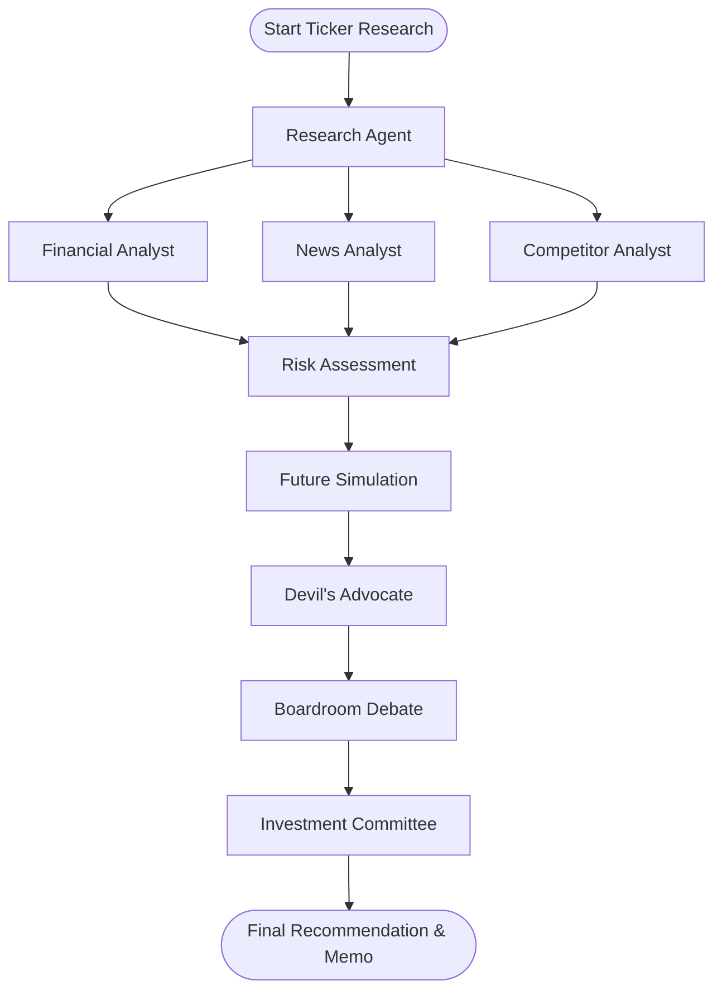

# AI-IROS // Artificial Intelligence Investment Research Operating System

**Access Repository**: [https://github.com/mamatabalakatte/companyproj](https://github.com/mamatabalakatte/companyproj)

AI-IROS is a production-grade, luxury Bloomberg-style autonomous investment research suite. The platform conducts deep research on equities, runs simulations, and coordinates an 8-agent boardroom debate using **LangGraph.js** to decide whether to **Invest, Hold, or Pass**.

Built as a Next.js App Router project in TypeScript, the UI leverages premium Vanilla CSS Modules, glassmorphism layers, custom SVG charts, and interactive calculations to deliver ultimate recruiter wow-factor and production-grade engineering visibility.

---

## 💎 Elite Recruiter Wow-Factors

1.  **Interactive DCF Sandbox**: Drag WACC, terminal growth, operating margins, and CAGR parameters to recalculate intrinsic value and valuation spreads in real time.
2.  **Web Audio API Terminal Synth**: Oscillators synthesize hardware beeps, typing clicks, and chime sounds natively without loading external static audio assets.
3.  **Consensus Audio Briefing**: Integrated browser SpeechSynthesis (TTS) reads out boardroom consensus, decision recommendations, and key arguments in a high-tech style.
4.  **Custom SVG DNA Radar**: Polaris coordinate-plotted vector radar rendering Moat, Growth, Innovation, Leadership, and Stability metrics with zero heavy chart library overhead.
5.  **Monte Carlo Price Envelope**: Visualizes normal distributions of target prices over Bull, Bear, and Black Swan metrics using custom SVG bezier curve rendering.
6.  **Real-Time Decryption Console**: Terminal output screen streaming live graph execution logs and agent reasoning pathways as they happen.

---

## 🏗️ Multi-Agent Boardroom Architecture

The application implements a state-based multi-agent system orchestrated by `@langchain/langgraph`:



### The 8 Autonomous Agents:
1.  **Research Agent**: Conducts initial data sweeps, queries financial databases, and structures SEC filing content.
2.  **Financial Analyst**: Evaluates balance sheets, capital structures, cash flow parameters, and ratios.
3.  **News & Sentiment Analyst**: Assesses public headlines, social media channels, and public relations momentum.
4.  **Competitor Analyst**: Maps comparative moat metrics and benchmarks operating efficiency against sector peers.
5.  **Risk Assessment Agent**: Highlights tail-risks, supply-chain vulnerabilities, and regulatory bottlenecks.
6.  **Future Simulation Agent**: Constructs scenario matrices for Bull, Base, Bear, and Black Swan price targets.
7.  **Devil's Advocate Agent**: Challenges boardroom consensus and pushes back on standard bullish/bearish assumptions.
8.  **Investment Committee Agent**: Moderates final debate, tallies ballots, determines consensus, and drafts the Institutional Memo.

---

## 📂 Project Structure

```txt
src/
├── app/
│   ├── api/
│   │   └── research/
│   │       └── route.ts         # SSE Server-Sent Events streaming endpoint
│   ├── globals.css              # Obsidian dark theme design system & print styles
│   ├── layout.tsx               # Root container & SEO title tags
│   └── page.tsx                 # Main dashboard layout & search panel
├── components/
│   ├── Boardroom.tsx            # Debate UI, Web Audio synth & TTS engine
│   ├── DcfSandbox.tsx           # Slider-driven interactive valuation model
│   ├── DnaRadar.tsx             # Custom SVG Radar chart for DNA scoring
│   ├── Memo.tsx                 # Institutional Markdown viewer & PDF print triggers
│   ├── MonteCarlo.tsx           # Gaussian probability distribution curve chart
│   ├── SentimentGrid.tsx        # Sentiment category matrix and strength bars
│   └── Simulations.tsx          # Bull, Bear, Base, Black Swan model card list
└── lib/
    └── agents/
        ├── graph.ts             # LangGraph.js node declarations & edges
        ├── prompts.ts           # System prompts & mock simulation generator
        └── types.ts             # TypeScript interfaces for agent states
```

---

## 💾 Database & RAG-Ready Architecture

AI-IROS is structured to easily attach to a Vector Database (e.g., Pinecone, pgvector) for Retrieval-Augmented Generation (RAG). 

### SEC Filing & Memo Schema (RAG Documents):
```sql
CREATE TABLE company_profiles (
    ticker VARCHAR(10) PRIMARY KEY,
    name VARCHAR(255) NOT NULL,
    sector VARCHAR(100),
    summary TEXT
);

CREATE TABLE documents (
    id UUID PRIMARY KEY DEFAULT gen_random_uuid(),
    ticker VARCHAR(10) REFERENCES company_profiles(ticker),
    content TEXT NOT NULL,
    metadata JSONB, -- { 'source': '10-K', 'year': 2026, 'quarter': 'Q1', 'section': 'MD&A' }
    embedding vector(1536) -- For pgvector similarity search
);

CREATE TABLE investment_memos (
    id UUID PRIMARY KEY DEFAULT gen_random_uuid(),
    ticker VARCHAR(10) REFERENCES company_profiles(ticker),
    recommendation VARCHAR(10) CHECK (recommendation IN ('INVEST', 'HOLD', 'PASS')),
    confidence INTEGER,
    memo_markdown TEXT,
    created_at TIMESTAMP DEFAULT CURRENT_TIMESTAMP
);
```

---

## ⚡ Setup & Run Locally

### 1. Install Dependencies
```bash
npm install
```

### 2. Configure Environment Variables
Create a `.env.local` file at the root to enable live LLM models and search feeds (if keys are omitted, the system defaults to high-fidelity customized simulation streams immediately):
```env
# Google Gemini API key
GEMINI_API_KEY="your-gemini-api-key"

# Tavily API key for live search integration
TAVILY_API_KEY="your-tavily-api-key"
```

### 3. Run Development Server
```bash
npm run dev
```
Open `http://localhost:3000` in your browser.

### 4. Build Production Bundle
To verify build type safety and performance compilation:
```bash
npm run build
npm run start
```

---

## 🚀 Deployment Guide for Vercel

The system is configured for serverless execution:
1.  Push your code to a GitHub repository.
2.  Import the repository into the **Vercel Dashboard**.
3.  Configure environment variables (`GEMINI_API_KEY`, `TAVILY_API_KEY`) under Project Settings.
4.  Click **Deploy**. Next.js App Router and dynamic route configurations are instantly handled by Vercel Edge/Serverless functions.
